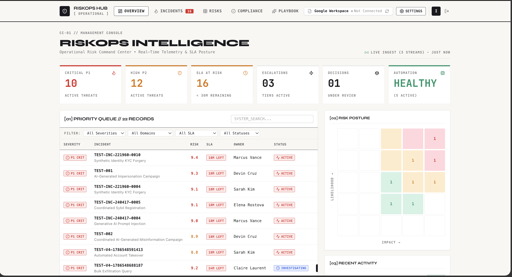
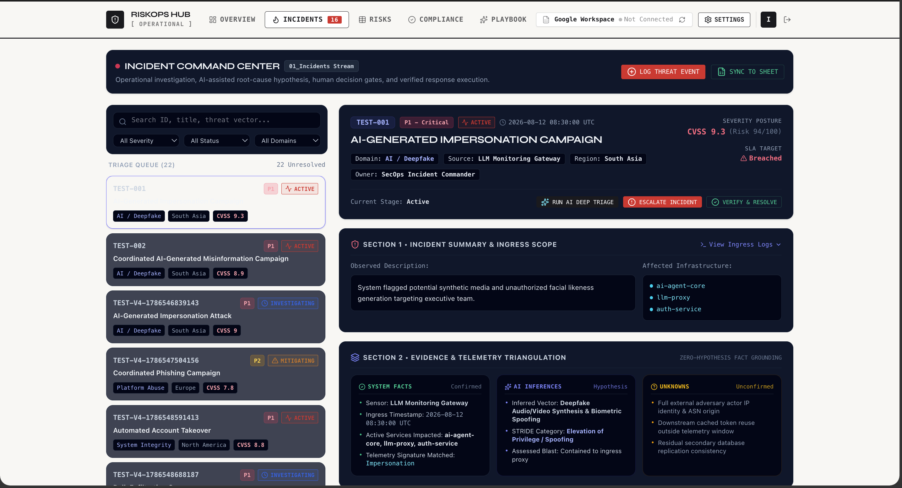
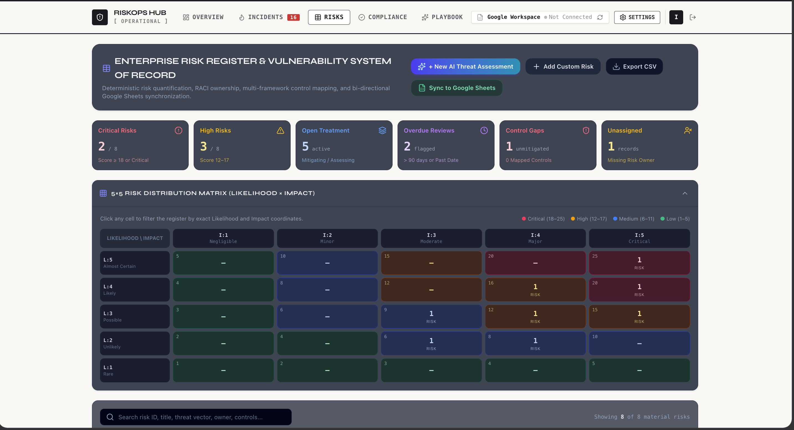
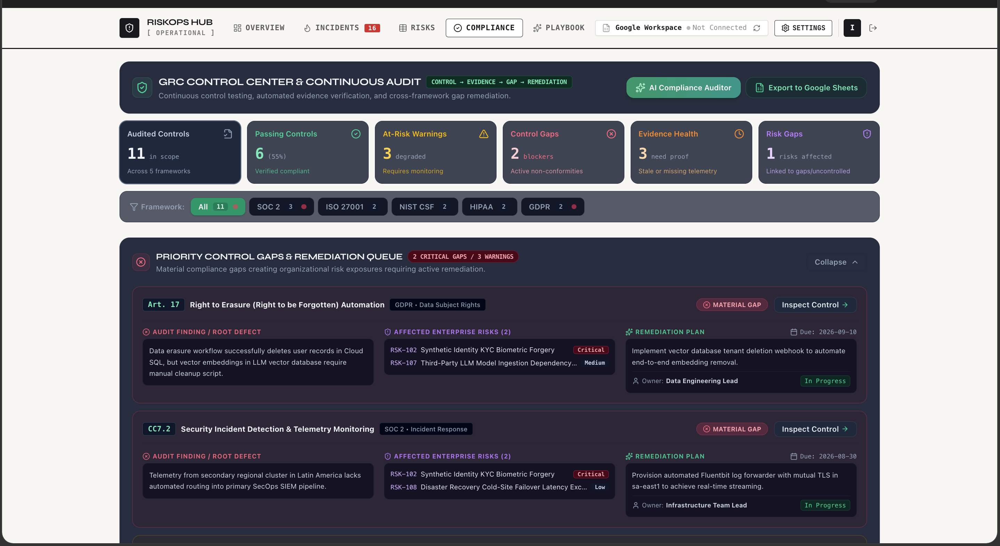
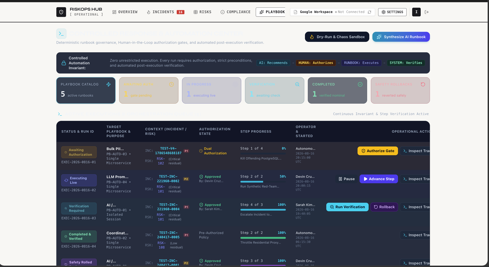
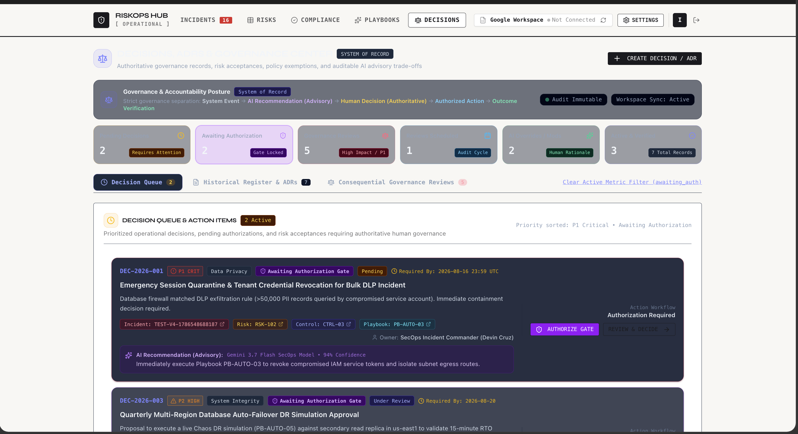
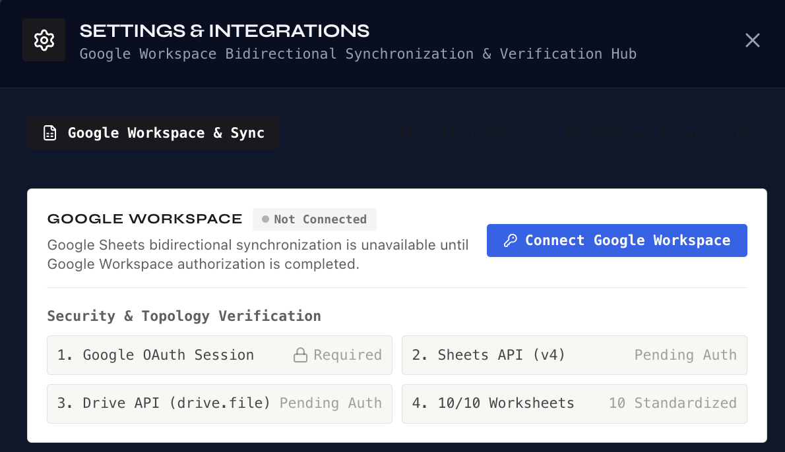

<div align="center">

<br/>

```
██████╗ ██╗███████╗██╗  ██╗ ██████╗ ██████╗ ███████╗
██╔══██╗██║██╔════╝██║ ██╔╝██╔═══██╗██╔══██╗██╔════╝
██████╔╝██║███████╗█████╔╝ ██║   ██║██████╔╝███████╗
██╔══██╗██║╚════██║██╔═██╗ ██║   ██║██╔═══╝ ╚════██║
██║  ██║██║███████║██║  ██╗╚██████╔╝██║     ███████║
╚═╝  ╚═╝╚═╝╚══════╝╚═╝  ╚═╝ ╚═════╝ ╚═╝     ╚══════╝

     ──────── RISKOPS INTELLIGENCE & AUTOMATION HUB ────────
     Governed Risk Intelligence · Human-Authorized Automation · Audit-Ready
```

<br/>

[](#)
[](#)
[](#)
[](#)
[](#)
[](#)

<br/>

> Governed operational risk intelligence, incident command, compliance, decision governance, and controlled automation — connected through a human-authorized operating model.

<br/>

> **Built for:** Security analysts · Risk officers · Compliance teams · Incident commanders

<br/>

```
AI recommends. Humans authorize. Systems execute. Verification confirms. Audit remembers.
```

<br/>

---

</div>

## 🗺️ How RiskOps Works — From Signal to Audit

> **RiskOps does not detect security events on its own.**
> It receives incidents from multiple external sources, enriches them with AI analysis, routes them through human authorization, and records every decision in an immutable audit ledger.

Think of it as a **command and governance layer** — not a sensor.

| Principle | What it means |
|:---|:---|
| 🤖 **AI recommends** | AI analyzes and hypothesizes — it never acts |
| 👤 **Humans authorize** | Every consequential decision requires explicit operator approval |
| ⚙️ **Systems execute** | Runbooks run only after the human gate is cleared |
| ✅ **Verification confirms** | Outcomes are independently checked before closure |
| 📋 **Audit remembers** | Every action is recorded — immutably, always |

```
┌──────────────────────────────────────────────────────────────────┐
│                     DETECTION SOURCES                            │
│                                                                  │
│  🔍 SIEM Alerts   📋 Manual Reports   🪝 Webhooks & APIs        │
│  📊 Spreadsheets  🔗 Integrated Tools  📡 External Feeds         │
└─────────────────────────────┬────────────────────────────────────┘
                              │  incidents enter RiskOps here
                              ▼
┌──────────────────────────────────────────────────────────────────┐
│                    RISKOPS INGESTION LAYER                       │
│         Parse · Validate · Enrich · Classify · Route             │
└─────────────────────────────┬────────────────────────────────────┘
                              │
                              ▼
┌──────────────────────────────────────────────────────────────────┐
│                      AI ANALYSIS                                 │
│   Threat assessment · Root-cause hypotheses · Risk scoring       │
│   ⚠️  Advisory only — AI never authorizes or executes            │
└─────────────────────────────┬────────────────────────────────────┘
                              │
                              ▼
┌──────────────────────────────────────────────────────────────────┐
│                   HUMAN DECISION GATE  ◄── critical boundary     │
│      Operator reviews evidence + AI analysis → Authorizes        │
└─────────────────────────────┬────────────────────────────────────┘
                              │
                              ▼
┌──────────────────────────────────────────────────────────────────┐
│                  CONTROLLED EXECUTION                            │
│        Runbooks execute only after explicit authorization         │
└─────────────────────────────┬────────────────────────────────────┘
                              │
                              ▼
┌──────────────────────────────────────────────────────────────────┐
│                     VERIFICATION                                 │
│          Independent confirmation of containment outcome         │
└─────────────────────────────┬────────────────────────────────────┘
                              │
                              ▼
┌──────────────────────────────────────────────────────────────────┐
│                     AUDIT LEDGER                                 │
│    Immutable · WHO · WHAT · WHEN · WHY · OUTCOME · Always records│
└──────────────────────────────────────────────────────────────────┘
```

> **Google Sheets** is a governed synchronization and data-exchange mechanism — a structured bridge for importing, exporting, and reviewing operational records. It is not an attack-detection engine.

---

## 🌟 Core Capabilities

```
┌─────────────────────────────────────────────────────────────────────────┐
│                        PLATFORM CAPABILITIES                            │
├──────────────────────────────┬──────────────────────────────────────────┤
│  🚨  Incident Command        │  Evidence-grounded triage, AI hypotheses,│
│                              │  containment, verification & audit        │
├──────────────────────────────┼──────────────────────────────────────────┤
│  📋  Enterprise Risk         │  Likelihood-impact assessment, treatment  │
│      Register                │  ownership, control mapping, residual risk│
├──────────────────────────────┼──────────────────────────────────────────┤
│  ⚖️  Compliance & GRC        │  SOC 2, ISO 27001, NIST CSF, HIPAA,     │
│                              │  GDPR — controls, gaps, remediation      │
├──────────────────────────────┼──────────────────────────────────────────┤
│  🤖  Governed Automation     │  Authorization gates, sequential runbooks,│
│                              │  rollback controls, execution audit       │
├──────────────────────────────┼──────────────────────────────────────────┤
│  🧾  Decision Governance     │  ADRs, approvals, AI reasoning provenance,│
│                              │  consequential decision lifecycle records  │
├──────────────────────────────┼──────────────────────────────────────────┤
│  🔄  Google Workspace Sync   │  Bidirectional 10-tab workbook sync with  │
│                              │  conflict detection & data-loss safeguards│
└──────────────────────────────┴──────────────────────────────────────────┘
```

---

## 📸 Platform Preview

### 📊 Operational Command Center
> Consolidated view of incidents, risks, compliance posture, automation activity, and operational signals.



---

### 🚨 Incident Command Center
> Structures investigations around evidence, AI hypotheses, risk assessment, human authorization, controlled containment, verification, and auditability.



---

### 📋 Enterprise Risk Register
> Centralized risk posture management — likelihood-impact assessment, treatment ownership, control relationships, review cadence, and residual-risk tracking.



---

### ⚖️ Compliance & GRC Control Center
> Connects controls, evidence, gaps, enterprise risks, remediation actions, and audit history across SOC 2, ISO 27001, NIST CSF, HIPAA, and GDPR.



---

### 🤖 Controlled Response & Automation Center
> Governs playbook execution through authorization gates, sequential execution, verification requirements, rollback controls, and audit logging.



---

### 🧾 Decisions & Governance
> System of record for consequential decisions, ADRs, approvals, trade-offs, AI reasoning provenance, and governance lifecycle events.



---

### 🔄 Google Workspace Integration
> Governed bidirectional synchronization across a standardized 10-tab Google Sheets workbook — import previews, conflict detection, and data-loss safeguards.



---

## 🏗️ System Architecture

```
┌─────────────────────────────────────────────────────────────┐
│                        CLIENT LAYER                         │
│   React 19 · TypeScript · Tailwind CSS · Lucide Icons       │
│   State Machine · Three-Way Diff Engine · Conflict Resolver │
└──────────────┬────────────────────────────┬─────────────────┘
               │                            │
               ▼  API Proxy                 ▼  OAuth2 Token Client
┌──────────────────────────┐  ┌─────────────────────────────────┐
│    Node.js / Express     │  │      Google Workspace APIs      │
│  Server-side Gemini AI   │  │  Sheets API v4 · Drive API      │
│  Zero Public Key Leaks   │  │  10-Tab Schema · Bidirectional  │
└──────────────────────────┘  └─────────────────────────────────┘
```

### Six Workspaces

| Workspace | Purpose |
|:---|:---|
| **Executive Dashboard** | Enterprise posture, CVSS distributions, open risk totals, SLA timers |
| **Threat Matrix** | Threat-vector evaluation, severity analysis, adversarial risk assessment |
| **Incident Command** | Evidence-grounded investigation, triage, containment, verification, audit |
| **Playbooks & Automation** | Governed automation, authorization gates, execution tracking, rollback |
| **Compliance & Governance** | Controls, evidence, gaps, remediation, risks, governance records |
| **Analytics & SWOT** | Strategic risk analysis, operational analytics, SWOT assessment |

---

## 🤖 AI Governance

<table>
<tr>
<td width="50%" valign="top">

**✅ AI Can**
- Analyze threat context
- Generate probabilistic hypotheses
- Assist STRIDE threat modeling
- Suggest root-cause analysis
- Generate executive summaries
- Recommend mitigation approaches
- Generate candidate playbooks

</td>
<td width="50%" valign="top">

**❌ AI Cannot**
- Authorize containment actions
- Execute production playbooks
- Override human decisions
- Change authoritative records
- Resolve sync conflicts automatically
- Present inference as confirmed fact

</td>
</tr>
</table>

**Three-way separation enforced at every step:**

```
SYSTEM FACTS      confirmed telemetry only
AI INFERENCES     probabilistic hypotheses — clearly labelled
UNKNOWNS          unconfirmed — never treated as fact
```

---

## 🔄 Bidirectional Sync & Conflict Resolution

```
             ┌─────────────────────┐
             │       RISKOPS       │
             └──────────┬──────────┘
                        ↕  bidirectional
             ┌──────────┴──────────┐
             │   THREE-WAY DIFF    │
             │       ENGINE        │
             └──────────┬──────────┘
                        ↕
             ┌─────────────────────┐
             │    GOOGLE SHEETS    │
             └─────────────────────┘
```

**No silent overwrites — ever:**

```
LOCAL RISKOPS STATE ──┬── BASELINE ──┬── GOOGLE STATE
                      │              │
                      └──── DIFF ────┘
                                ↓
                         SYNC_CONFLICT
                                ↓
                       HUMAN RESOLUTION
                        ↙            ↘
               KEEP_RISKOPS      APPLY_GOOGLE
```

---

## 🛡️ Security & Data Protection

> ⚠️ **Compliance Notice:** Framework references (SOC 2, ISO 27001, NIST CSF, HIPAA, GDPR) represent governance and control-mapping capabilities and do not constitute certification or legal compliance.

- **Secrets** — API keys, credentials, and OAuth tokens remain outside source control and logs at all times
- **Access** — Google Workspace integrations use least-privilege authorization and restricted workbooks
- **AI** — AI output is advisory only; sensitive information is not submitted to AI services without explicit approval
- **Synchronization** — Schema validation, import previews, three-way conflict detection, and protected fields prevent unsafe data mutations
- **Demonstration Data** — Public repository content and screenshots contain only synthetic or anonymized data

---

## 📊 10-Tab Workbook Schema

| Tab | Purpose | Key |
|:---|:---|:---|
| `01_Incidents` | Operational incident records & CVSS telemetry | Incident_ID |
| `02_Risk_Rules` | Detection rules, thresholds, risk logic | Rule_ID |
| `03_Escalations` | Escalation tiers and response targets | Escalation_ID |
| `04_SLA` | MTTA/MTTR targets, breach tracking | SLA_ID |
| `05_Audit_Log` | Chronological structured audit events | Audit_ID |
| `06_Config` | Workspace configuration | Config_Key |
| `07_Dashboard` | Aggregate operational metrics | Metric_Key |
| `08_Decision_Register` | Decisions, approvals, governance records | Decision_ID |
| `09_Automation_Log` | Playbook execution and rollback history | Execution_ID |
| `10_SWOT_Analysis` | Strategic operational analysis | SWOT_ID |

---

## ✅ V1.0.0 Release Status

```
╔══════════════════════════════════════════════════════════════╗
║        RISKOPS INTELLIGENCE & AUTOMATION HUB — V1.0.0       ║
╠══════════════════════════════════════════════════════════════╣
║  VERSION              1.0.0                                  ║
║  STATUS               FROZEN / VERIFIED                      ║
║  TYPECHECK            PASS                                   ║
║  PRODUCTION BUILD     PASS                                   ║
║  REGRESSION           22 / 22 PASSED                        ║
║  GOOGLE WORKSPACE     10 / 10 TABS VERIFIED                 ║
║  BIDIRECTIONAL SYNC   VERIFIED                               ║
║  CONFLICT HANDLING    VERIFIED                               ║
║  SAFETY GATES         VERIFIED                               ║
║  AI GOVERNANCE        ADVISORY ONLY                          ║
╚══════════════════════════════════════════════════════════════╝
```

---

## 💻 Tech Stack

```
┌──────────────────────────────────────────────────────────────┐
│               RISKOPS INTELLIGENCE & AUTOMATION HUB          │
│                          TECH STACK                          │
├──────────────────────┬───────────────────────────────────────┤
│  Frontend            │  React 19, TypeScript, Tailwind CSS   │
│  Backend             │  Node.js, Express                     │
│  AI                  │  Google Gemini (server-side only)     │
│  Cloud Integration   │  Google Identity Services             │
│                      │  Google Sheets API v4, Drive API      │
│  Runtime             │  Bun / Node.js 18+                    │
│  Verification        │  Deterministic E2E Suite (22 tests)   │
└──────────────────────┴───────────────────────────────────────┘
```

---

## 🚀 Local Development

```bash
# Clone
git clone https://github.com/Imtiaz-laskar/riskops-intelligence-hub.git
cd riskops-intelligence-hub

# Install
npm install

# Configure — never commit real credentials
cp .env.example .env

# Develop
npm run dev

# Type check
npm run lint

# Build
npm run build
```

| Variable | Description |
|:---|:---|
| `GEMINI_API_KEY` | Google Gemini API key — server-side only |
| `APP_URL` | Base application URL (default: `http://localhost:3000`) |
| `VITE_GOOGLE_CLIENT_ID` | Google OAuth 2.0 Web Client ID |

---

## 💡 Design Philosophy

> *Automation should increase operational capability without removing human accountability.*

```
DETECTION SOURCES  →  INGESTION  →  AI ANALYSIS  →  HUMAN DECISION
                                                            ↓
                                          AUTHORIZATION  →  EXECUTION
                                                                ↓
                                                    VERIFICATION  →  AUDIT
```

The goal is not to make security operations autonomous.
The goal is to make them **observable, explainable, governable, and accountable.**

---

<div align="center">

**Built for operators who need clarity under pressure.**

<br/>

*RiskOps Intelligence & Automation Hub — Governed by design. Accountable by default.*

<br/>

```
Copyright (c) 2026 Imtiaz Hussain Laskar. All Rights Reserved.
```

</div>
